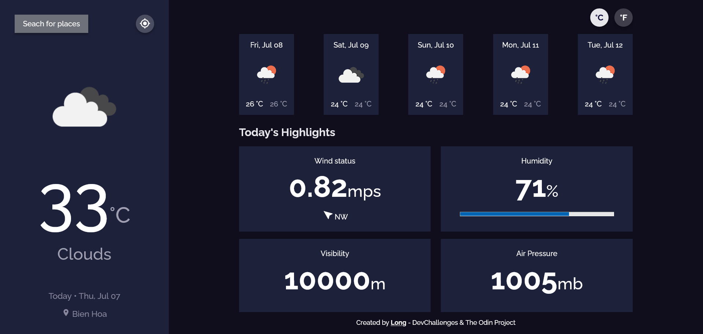
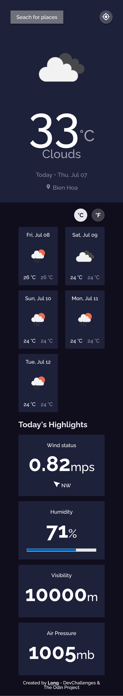

<h1 align="center">Weather Forecast</h1>

   Solution for a challenge from <a href="https://devchallenges.io/challenges/mM1UIenRhK808W8qmLWv" target="_blank">DevChallenges</a> and <a href="https://www.theodinproject.com/lessons/node-path-javascript-weather-app" target="_blank">The Odin Project</a>

  <h3>
    <a href="https://www.figma.com/file/5X3Ao3gEqZPqqKctP7riDF/weather-app">
      Design File
    </a>
     | 
    <a href="https://{your-url-to-the-solution}">
      Code Solution
    </a>
    </a>
     | 
    <a href="https://{your-demo-link.your-domain}">
     Live Demo
  </h3>

## Table of Contents

- [Overview](#overview)
  - [Built With](#built-with)
- [Features](#features)
- [Contact](#contact)
- [Acknowledgements](#acknowledgements)

## Overview

### Built With

- [Sass](https://sass-lang.com/)
- [Webpack](https://webpack.js.org/)
- [Open Weather API](https://openweathermap.org/)

## Features

This application/site was created as a submission to [DevChallenges](https://devchallenges.io/challenges/mM1UIenRhK808W8qmLWv) and [The Odin Project](https://www.theodinproject.com/lessons/node-path-javascript-weather-app) challenges. - The challenge was to build an application to complete the given user stories:

- [ ] **Able to search for a specific cities or location**
- [x] See city weather as default
- [x] See weather of today and the next 5 days
- [x] See the date and location of the weather
- [x] See according to image for each type of weather
- [x] See the min and max degree each day
- [x] See wind status and wind direction
- [x] See humidity percentage
- [x] See a visibility indicator
- [x] See the air pressure number
- [ ] **Toggle to displaying the temperature in Celsius to Fahrenheit and vice versa**
- [ ] *(Optional) Request my current location weather*

## Acknowledgements

- [HTML5 Progress Bar](https://developer.mozilla.org/en-US/docs/Web/HTML/Element/progress) from [Samuel Dawson](https://www.journaldev.com/4823/html5-progress-bar) and [Pankaj Parashar](https://css-tricks.com/html5-progress-element/).

- Change a CSS Background Image’s Opacity from [Nicholas Cerminara & Andy Hattemer post](https://www.digitalocean.com/community/tutorials/how-to-change-a-css-background-images-opacity) and [Coder Coder
 video](https://youtu.be/LQsjNmkqUOc).

## Contact

- GitHub [@minhlong149](https://github.com/minhlong149)
